# AFAD Seismic Data Replay Testing

## Goal

Feed real earthquake and non-earthquake acceleration time-series through the **existing** `StaLtaCalculator` and `FeatureExtractor` code (no changes to production code), producing a results table that proves or disproves the current thresholds.

## Data Pipeline

```mermaid
flowchart LR
  subgraph dataPrep [Data Preparation - one time]
    SAC["AFAD SAC/ASC files"]
    Conv["Python converter script"]
    CSV["CSV fixtures in test/fixtures/"]
  end

  subgraph replayDart [Dart Replay - repeatable]
    Load["Load CSV rows"]
    StaLta["StaLtaCalculator.addSample"]
    FeatBuf["Feature buffer"]
    FeatExt["FeatureExtractor.analyze"]
    Result["DetectionResult per file"]
  end

  subgraph output [Output]
    Table["Pass/fail summary table"]
    Tune["Adjust earthquake_config.dart"]
  end

  SAC --> Conv --> CSV
  CSV --> Load --> StaLta --> FeatBuf --> FeatExt --> Result --> Table --> Tune
```




## Part 1: Data Acquisition and Conversion

### Where to get the data

- **Earthquake data**: Download the Zenodo dataset at [https://zenodo.org/records/16930394](https://zenodo.org/records/16930394) (`Wu_etal_JGR_StrongMotionData.zip`, 11.7 MB, free, no login). ontCains SAC-format acceleration from the **2023 Mw 7.8 Kahramanmaras** earthquake at multiple stations/distances.
- **Daily-activity data**: Record 30-60 seconds of your own phone accelerometer during **walking**, **bus/metro**, **phone on table**, and **phone drop** scenarios using any sensor logger app (e.g. "Physics Toolbox" or "Sensor Logger" from Play Store) and export as CSV.

### Python converter script

Create `tool/convert_sac_to_csv.py` — a small script that:

1. Reads a SAC file (using the `obspy` library: `pip install obspy`)
2. Extracts the acceleration time-series and sample rate
3. Resamples to 25 Hz (to match `EarthquakeConfig.samplesPerSecond`)
4. Outputs a CSV: `timestamp_ms,acc_x,acc_y,acc_z`
  - For single-component station data: place the horizontal component in `acc_x`, set `acc_y=0`, `acc_z=9.81` (simulating gravity on Z axis at rest, so the `(magnitude - 9.81).abs()` math in STA/LTA works correctly)
  - For 3-component stations: use E→x, N→y, U→z (add 9.81 to U to simulate raw accelerometer)

The script should accept a directory of SAC files and output one CSV per station into `test/fixtures/earthquake/` or `test/fixtures/daily/`.

### Fixture directory structure

```
hayat-agi-mobile/
  test/
    fixtures/
      earthquake/
        kahramanmaras_stn0131_25hz.csv
        kahramanmaras_stn0246_25hz.csv
        ...
      daily/
        walking_30s.csv
        bus_ride_60s.csv
        table_still_30s.csv
        phone_drop.csv
```

Each CSV format (simple, no header complexity):

```
acc_x,acc_y,acc_z
0.12,0.05,9.83
0.15,-0.02,9.79
...
```

One row per sample at 25 Hz (40 ms apart).

## Part 2: Dart Replay Runner

### `test/earthquake_replay_test.dart`

A `flutter test` file that:

1. Reads each CSV from `test/fixtures/earthquake/` and `test/fixtures/daily/`
2. For each file, creates a fresh `StaLtaCalculator` and feature buffer (same `Queue<double>` + same logic as [earthquake_detection_service.dart](hayat-agi-mobile/lib/features/earthquake_detection/earthquake_detection_service.dart) lines 100-128)
3. Loops through each row, calling `staLta.addSample(x, y, z)`, maintaining the rolling feature buffer, and checking trigger conditions
4. Records: **did it trigger?**, **at which sample index?**, **STA/LTA ratio at trigger**, **FeatureResult values** (IQR, ZC, CAV, peak)
5. Prints a summary table to the test output

### Shared replay logic: `test/helpers/replay_runner.dart`

Extract the sample-processing loop into a reusable class so both tests and any future CLI tool use the same code:

```dart
class ReplayResult {
  final String fileName;
  final bool triggered;
  final int? triggerSampleIndex;
  final double? staLtaRatio;
  final FeatureResult? features;
  final int totalSamples;
}

class ReplayRunner {
  /// Run the full detection pipeline on a list of (x, y, z) samples.
  /// Returns the first detection result (or no-trigger).
  static ReplayResult run(String fileName, List<(double, double, double)> samples);
}
```

### Test structure

```dart
group('Earthquake files should trigger', () {
  // For each CSV in test/fixtures/earthquake/:
  // test('kahramanmaras_stn0131 triggers detection', () { ... });
});

group('Daily activity files should NOT trigger', () {
  // For each CSV in test/fixtures/daily/:
  // test('walking does not trigger', () { ... });
});
```

The earthquake tests use `expect(result.triggered, isTrue)`. The daily tests use `expect(result.triggered, isFalse)`. When a test fails, it means the thresholds need tuning.

## Part 3: Results Table Output

After all files run, print a markdown-style table:

```
| File                        | Triggered | Sample | Ratio | IQR  | ZC   | CAV  | Peak  |
|-----------------------------|-----------|--------|-------|------|------|------|-------|
| earthquake/kahramanmaras... | YES       | 312    | 8.4   | 4.2  | 7.1  | 3.8  | 12.3  |
| daily/walking_30s.csv       | NO        | -      | 1.2   | 0.3  | 2.1  | 0.4  | 0.8   |
```

This table is what goes into the thesis as evidence.

## Files to Create


| File                                | Purpose                                  |
| ----------------------------------- | ---------------------------------------- |
| `tool/convert_sac_to_csv.py`        | Python script: SAC/ASC to 25Hz CSV       |
| `tool/requirements.txt`             | `obspy` dependency for the converter     |
| `test/helpers/replay_runner.dart`   | Shared replay logic (loop + detect)      |
| `test/earthquake_replay_test.dart`  | Flutter test: load fixtures, run, assert |
| `test/fixtures/earthquake/.gitkeep` | Placeholder for earthquake CSVs          |
| `test/fixtures/daily/.gitkeep`      | Placeholder for daily-activity CSVs      |


No production code is modified.