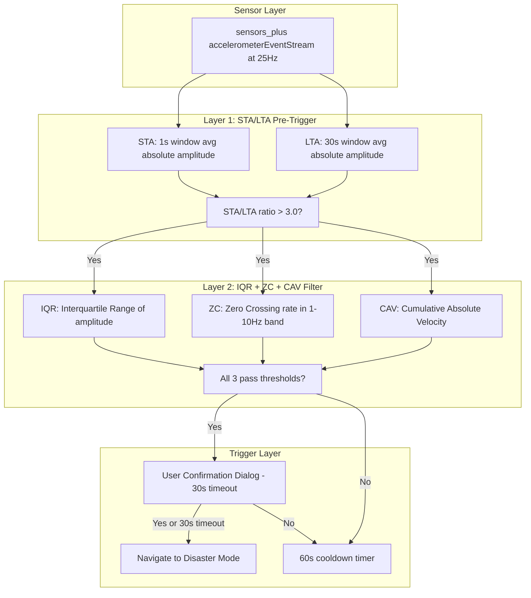
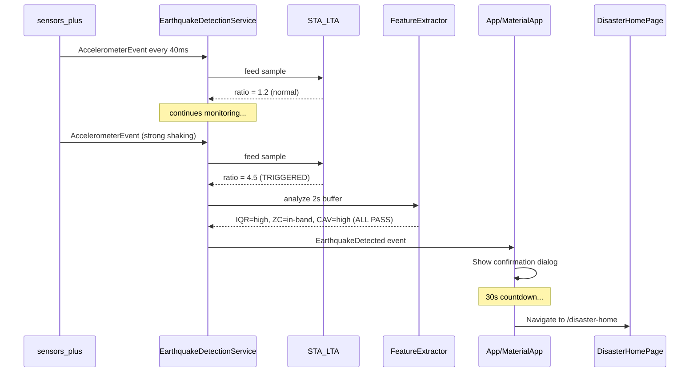

# Earthquake Detection - Phase 1: On-Device Accelerometer Detection

## Architecture Overview

The system uses a two-layer detection pipeline running in the foreground. Layer 1 (STA/LTA) is cheap and runs continuously; Layer 2 (IQR/ZC/CAV) activates only when Layer 1 triggers, keeping CPU/battery usage minimal.




## New Dependency

Add to [pubspec.yaml](hayat-agi-mobile/pubspec.yaml):

```yaml
sensors_plus: ^7.0.0
```

## File Structure

All new files under `lib/features/earthquake_detection/`:

```
lib/features/earthquake_detection/
  earthquake_detection_service.dart   # Singleton service: sensor stream + pipeline orchestration
  algorithms/
    sta_lta.dart                      # STA/LTA sliding window calculator
    feature_extractor.dart            # IQR, ZC, CAV calculators
  earthquake_config.dart              # All tunable thresholds in one place
  earthquake_state.dart               # State enum + event model
  widgets/
    earthquake_confirm_dialog.dart    # "Deprem mi hissettiniz?" overlay
```

## Component Details

### 1. `earthquake_config.dart` - Centralized Thresholds

All tunable parameters from the document in one class for easy calibration:

- STA window: **1 second** (25 samples at 25Hz)
- LTA window: **30 seconds** (750 samples)
- STA/LTA trigger threshold: **3.0**
- Minimum gal threshold: **3 gal** (noise floor at 0.3 gal)
- Sampling rate: **25 Hz** (40ms interval)
- Cooldown period: **60 seconds**
- User confirmation timeout: **30 seconds**
- IQR/ZC/CAV thresholds (initial values from MyShake/OpenEEW references, to be calibrated with AFAD data)

### 2. `algorithms/sta_lta.dart` - STA/LTA Calculator

Maintains two circular buffers (short-term and long-term) of absolute acceleration magnitude. On each new sample:

1. Compute vector magnitude: `sqrt(x^2 + y^2 + z^2)`
2. Subtract gravity (~9.81 m/s^2) to get net acceleration
3. Push into both STA buffer (25 samples) and LTA buffer (750 samples)
4. Return `STA_avg / LTA_avg` ratio
5. Trigger when ratio exceeds 3.0

Key design: Use `dart:collection` `Queue` with fixed capacity for O(1) sliding window. LTA update uses running sum (add new, subtract oldest) to avoid recomputing.

### 3. `algorithms/feature_extractor.dart` - IQR + ZC + CAV

Activated only when STA/LTA triggers. Works on a 2-second buffer (50 samples):

- **IQR (Interquartile Range):** Sort amplitude values, compute Q3-Q1. Earthquakes produce high IQR (large amplitude variation). Walking/vehicle vibration has lower IQR.
- **ZC (Zero Crossing Rate):** Count sign changes in the acceleration signal. Earthquake signals concentrate in 1-10 Hz band. Human activity produces different frequency patterns.
- **CAV (Cumulative Absolute Velocity):** `sum(|a_i| * dt)` over the window. Earthquakes accumulate high energy over sustained duration. A single impact (phone drop) produces low CAV.

Each feature compared against calibration thresholds. All three must pass for a positive detection.

### 4. `earthquake_detection_service.dart` - Main Singleton Service

This is the orchestrator, following the same singleton pattern as [BleService](hayat-agi-mobile/lib/features/ble/ble_service.dart):

```dart
class EarthquakeDetectionService {
  static final _instance = EarthquakeDetectionService._internal();
  factory EarthquakeDetectionService() => _instance;
}
```

Responsibilities:

- Subscribe to `userAccelerometerEventStream(samplingPeriod: Duration(milliseconds: 40))` (gravity-removed stream is better for seismic analysis)
- Feed samples into STA/LTA calculator continuously
- When STA/LTA triggers: fill a 2-second feature buffer, run IQR+ZC+CAV
- If all pass: emit `EarthquakeDetected` event via a reactive stream (GetX `Rx` or `StreamController`)
- Manage cooldown timer (ignore re-triggers for 60s)
- Expose `start()`, `stop()`, `isMonitoring` state
- Provide a `ValueNotifier<EarthquakeState>` for UI reactivity (matching the dual-reactivity pattern in BleService)

### 5. `earthquake_state.dart` - State Model

```dart
enum EarthquakeMonitorState { idle, monitoring, suspicious, confirmed, cooldown }

class EarthquakeEvent {
  final double magnitude;    // estimated gal value
  final double staLtaRatio;
  final double iqr;
  final double zeroCrossingRate;
  final double cav;
  final DateTime timestamp;
}
```

### 6. `widgets/earthquake_confirm_dialog.dart` - User Confirmation

A full-screen overlay dialog shown when a single-device detection occurs:

- Title: "Deprem mi hissettiniz?" 
- Two buttons: "Evet" (Yes) and "Hayir" (No)
- 30-second countdown timer displayed prominently
- If "Evet" or timeout (user might be trapped): navigate to disaster mode
- If "Hayir": dismiss, enter cooldown
- Haptic feedback + alarm-style vibration on appearance

### 7. Integration Points

**[main.dart](hayat-agi-mobile/lib/main.dart):** Initialize and start monitoring after auth:

```dart
void main() async {
  WidgetsFlutterBinding.ensureInitialized();
  ApiClient();
  await AuthService().initialize();
  EarthquakeDetectionService().start(); // begin monitoring
  runApp(const MyApp());
}
```

**[app.dart](hayat-agi-mobile/lib/app.dart):** Add a listener at the `MaterialApp` level (via a wrapper widget or `navigatorKey`) that reacts to `EarthquakeDetected` events and shows the confirmation dialog / navigates to `AppRouter.disasterHome`.

**[app_router.dart](hayat-agi-mobile/lib/core/routing/app_router.dart):** No new routes needed -- we reuse the existing `/disaster-home` route.

**[disaster_home_page.dart](hayat-agi-mobile/lib/features/disaster_mode/disaster_home_page.dart):** Add an optional parameter or flag to indicate the page was auto-triggered by earthquake detection (for UI messaging like "Deprem algilandi - durumunuzu secin").

**Android Manifest** ([AndroidManifest.xml](hayat-agi-mobile/android/app/src/main/AndroidManifest.xml)): Add `HIGH_SAMPLING_RATE_SENSORS` permission for Android 12+:

```xml
<uses-permission android:name="android.permission.HIGH_SAMPLING_RATE_SENSORS" />
```

**iOS Info.plist:** Add `NSMotionUsageDescription` key for accelerometer access.

## Data Flow Summary




## Testing Strategy

- Unit test STA/LTA with synthetic sine waves and step functions
- Unit test IQR/ZC/CAV with known earthquake waveforms (AFAD catalog data can be replayed as sample arrays)
- Manual test by shaking the phone vigorously to validate the trigger chain
- Verify cooldown prevents rapid re-triggering
- Verify confirmation dialog timeout auto-navigates

